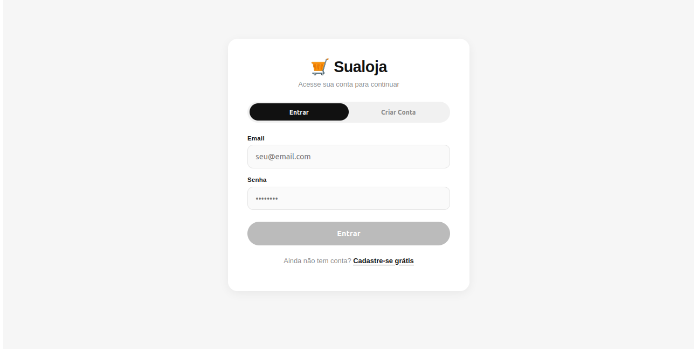
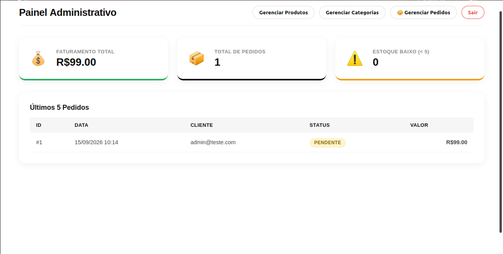

cat << 'EOF' > ~/Área\ de\ Trabalho/Vendas/README.md
# 🛒 Sistema de E-commerce Full Stack - API RESTful & Angular

<div align="center">


</div>

Sistema completo de e-commerce Full Stack, desenvolvido com **Spring Boot** (Backend) e **Angular** (Frontend). O projeto implementa um fluxo real de vendas, desde o gerenciamento de produtos pelo administrador até a finalização de compra pelo cliente, com autenticação segura via JWT e controle de acesso baseado em papéis (RBAC).

---

## 📸 Screenshots do Sistema

### 🔐 Tela de Login/Cadastro
<div align="center">

</div>

### 🏪 Página Inicial da Loja
<div align="center">

</div>

### 🛍️ Catálogo de Produtos
<div align="center">

</div>

### 📊 Painel Administrativo (Dashboard)
<div align="center">

</div>

### 🛒 Carrinho de Compras
<div align="center">

</div>

---

## ✨ Funcionalidades Principais

### 👤 Módulo do Cliente
- ✅ Cadastro e Login com JWT
- ✅ Catálogo de Produtos com Hero Carousel
- ✅ Carrinho de Compras com "Comprar Agora"
- ✅ Checkout com baixa automática de estoque
- ✅ Histórico de Pedidos com detalhes

### 🛠️ Módulo do Administrador
- ✅ Dashboard com métricas (Faturamento, Pedidos, Estoque Baixo)
- ✅ CRUD Completo de Produtos com Upload de Imagens
- ✅ CRUD de Categorias
- ✅ Gestão de Status de Pedidos
- ✅ Controle de acesso RBAC

---

## 🛠️ Stack Tecnológica

| Categoria | Tecnologia | Propósito |
| :--- | :--- | :--- |
| **Backend** | Java 17, Spring Boot 3.3.x | API RESTful |
| **Segurança** | Spring Security, JJWT, BCrypt | Autenticação JWT |
| **Persistência** | Spring Data JPA, PostgreSQL | Banco de dados |
| **Frontend** | Angular 17+, TypeScript, RxJS | SPA moderna |
| **Testes** | JUnit 5, Mockito, MockMvc | Testes automatizados |

---

## 📂 Estrutura do Projeto

```text
Vendas/
├── backend/api/
│   ├── src/main/java/com/sualoja/api/
│   │   ├── config/           # Security, JWT, CORS, Swagger
│   │   ├── controller/       # Endpoints REST (7 controllers)
│   │   ├── dto/              # Request e Response DTOs
│   │   ├── exception/        # Tratamento global de erros
│   │   ├── model/            # Entidades JPA e Enums
│   │   ├── repository/       # Interfaces Spring Data JPA
│   │   ├── security/         # Filtros JWT e UserDetailsService
│   │   └── service/          # Regras de negócio
│   ├── src/main/resources/
│   │   ├── application.yml   # Configurações da aplicação
│   │   └── db/migration/     # Versionamento do banco (Flyway)
│   ├── src/test/             # Testes unitários e de integração
│   └── uploads/produtos/     # Imagens dos produtos
│
├── frontend/
│   └── src/app/
│       ├── core/             # Serviços, Interceptors (JWT), Models
│       └── features/         # Componentes de UI (Standalone)
│           ├── admin/        # Dashboard, CRUD Produtos/Categorias
│           ├── cart/         # Carrinho de compras
│           ├── login/        # Tela de Login/Cadastro
│           ├── orders/       # Lista e detalhes de pedidos
│           ├── products/     # Catálogo com Hero Carousel
│           └── shared/       # Componentes reutilizáveis
│
├── docs/
│   └── screenshots/          # Imagens ilustrativas do sistema
└── README.md                 # Este arquivo


---


## 🚀 Como Rodar o Projeto

### Pré-requisitos
- JDK 17+ e Maven
- Node.js 18+ e Angular CLI
- PostgreSQL rodando na porta 5432


1. backend


cd backend/api
mvn spring-boot:run


2. Frontend

cd frontend
ng serve -o


Admin:
	
admin@teste.com
	
123456


Cliente:
	
teste@teste.com
	
123456


---


🔜 Próximos Passos

    Deploy em nuvem (Vercel + Render)
    Integração com gateway de pagamento
    Busca e filtros avançados
    Notificações Toast

	
